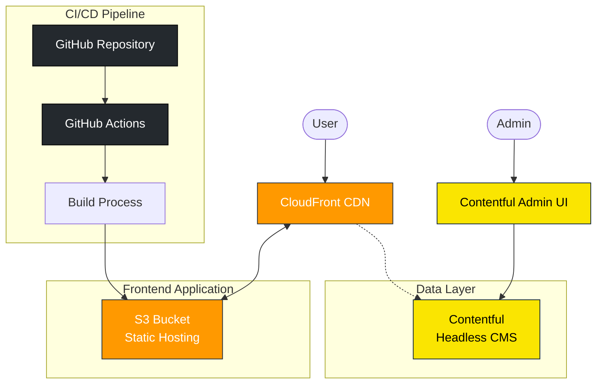

# Todo App

## Project Overview
A modern Todo list application leveraging cloud-based technologies. This app offers basic task management functionality such as adding, removing, and marking tasks as complete, while persisting data in Contentful (a headless CMS) and hosting the application on AWS CloudFront/S3 for a complete cloud-native solution.

Users can manage tasks through an intuitive interface, with filtering and pagination features for efficient handling of numerous tasks.

## Key Features
- Add, delete, and mark tasks as complete
- Filter tasks (all, active, completed)
- Pagination
- Cloud data persistence
- Responsive design

## Technology Stack
### Frontend
- React 18
- TypeScript
- CSS3
- Vite (build tool)

### Backend & Data
- Contentful (headless CMS)
- Contentful Management API
- Contentful Delivery API

### Infrastructure
- AWS S3 (static file hosting)
- AWS CloudFront (CDN)
- Terraform (IaC)
- GitHub Actions (CI/CD)

## Architecture
This application adopts a modern architecture with separated frontend and backend concerns.



- **User Interface**: Single-page application built with React + TypeScript
- **Data Storage**: Task data managed in Contentful CMS
- **Hosting**: Static files stored in AWS S3
- **Delivery**: Fast content delivery through AWS CloudFront
- **Infrastructure Management**: Infrastructure as Code using Terraform
- **Continuous Deployment**: Automated deployment pipeline using GitHub Actions

## Setup Instructions

### Prerequisites
- Node.js (v16 or higher)
- npm or yarn
- AWS account
- Contentful account

### Local Development Setup
1. Clone the repository
   ```bash
   git clone https://github.com/koh124/Todo-App.git
   cd Todo-App
   ```

2. Install dependencies
   ```bash
   npm install
   ```

3. Set up environment variables
   Copy `.env.example` to create a `.env` file and configure the necessary environment variables
   ```bash
   cp .env.example .env
   # Edit the .env file to add your Contentful credentials
   ```

4. Start the development server
   ```bash
   npm run dev
   ```

### Deployment
This project uses GitHub Actions to automatically deploy to AWS S3 and CloudFront when changes are pushed to the main branch.

For manual deployment:
1. Build the application
   ```bash
   npm run build
   ```

2. Upload build artifacts to S3
   ```bash
   aws s3 sync dist/ s3://your-bucket-name --delete
   ```

3. Invalidate CloudFront cache
   ```bash
   aws cloudfront create-invalidation --distribution-id YOUR_DISTRIBUTION_ID --paths "/*"
   ```

## Infrastructure Management
The infrastructure is codified using Terraform.

To run Terraform:
```bash
cd terraform
terraform init
terraform plan
terraform apply
```

## Screenshots


## Future Enhancements
- Task priority levels
- Categories/tagging functionality
- Dark mode support
- Offline support and data synchronization
- Performance optimizations

## License
MIT
